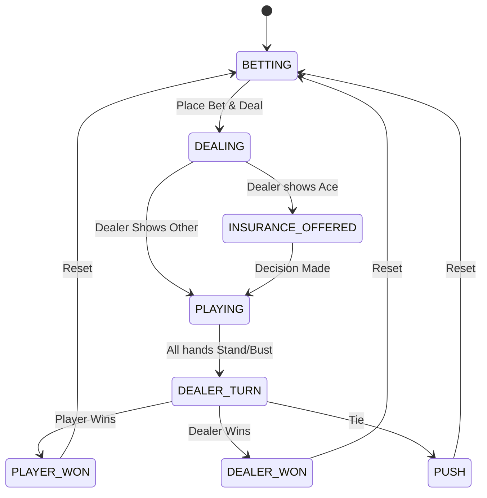

<div align="center">
  
  <h1>Blackjack Multiplatform</h1>
  <p>A premium, cross-platform Blackjack experience built with <b>Compose Multiplatform</b> and <b>JetBrains Amper</b>.</p>

  [](https://kotlinlang.org)
  [](https://www.jetbrains.com/lp/compose-multiplatform/)
  [](https://github.com/JetBrains/amper)
  [](https://kotlinlang.org/docs/multiplatform.html)
</div>

---

**Blackjack Multiplatform** is a high-fidelity, production-grade implementation of the classic casino game. It demonstrates a modern, reactive Kotlin Multiplatform (KMP) architecture, supporting **Android**, **iOS**, and **Desktop (JVM)** from a single shared codebase.

### ✨ Key Highlights

*   **Premium Visuals**: Sleek "glassmorphism" UI, dynamic card animations, and adaptive layouts for all screen sizes (Portrait, Compact Landscape, Wide Landscape).
*   **Full Casino Rules**: Comprehensive logic including Split (up to 3 hands), Double-down, Insurance, and Dealer AI with H17/S17 configurability.
*   **Advanced Side Bets**: Independent resolution logic for **21+3** and **Perfect Pairs** with mathematical precision.
*   **Strategy Engine**: Built-in **Basic Strategy Provider** for optimal play hints and performance auditing.
*   **Reactive Core**: A robust serial state machine pattern using `StateFlow` and decoupled `SharedFlow` side effects (spatial audio, haptic vibrations).
*   **Modern Tooling**: Built with **Amper** (no Gradle required), **Decompose** for lifecycle management, and **Jujutsu (jj)** for next-gen version control.

---

## 🏛 Architecture

The project follows a clean, reactive architecture with a unidirectional data flow (UDF).

### Game Status Lifecycle



### Module Map

> [!NOTE]
> This project uses a **Flat Module Layout**. File paths do not strictly match package declarations to improve navigation and build performance.

| Module | Responsibility |
| :--- | :--- |
| `shared/core` | **Domain Layer**: `BlackjackStateMachine`, `GameLogic`, immutable models (`GameState`, `Card`, `Hand`). |
| `shared/data` | **Data Layer**: Local persistence using DataStore and Room (KMP). |
| `sharedUI` | **UI Layer**: Shared Compose components, themes (Modern Dark/Gold), and service abstractions (Audio, Haptic interfaces). |
| `androidApp` | **Android Entry**: Platform-specific resources and activity setup. |
| `desktopApp` | **Desktop Entry**: JVM-specific entry point and windowing. |
| `iosApp` | **iOS Entry**: Swift-based entry point and UIViewController integration. |

---

## 📝 Documentation Strategy

We prioritize **AI-Friendly Documentation** to ensure future maintainability and agent context.

### Functional Intent over Implementation
KDoc strings focus on the **What** and **Why** rather than the "How". We document:
- **Functional Intent**: The purpose and role of the component.
- **Constraints**: Invariants, thread-safety, and usage limitations.
- **Invariants**: Fixed rules that the code must always satisfy.

Agents can read the code to see "how" it works. Documentation is for what they *can't* see.

---

## 🛠 Technology Stack

*   **Language**: Kotlin 1.9.22
*   **UI Framework**: [Compose Multiplatform](https://www.jetbrains.com/lp/compose-multiplatform/)
*   **Build System**: [JetBrains Amper](https://github.com/JetBrains/amper)
*   **State Management**: `StateFlow` + [Decompose](https://github.com/arkivanov/Decompose)
*   **Versioning**: [Jujutsu (jj)](https://github.com/martinvonz/jj)
*   **Serialization**: `kotlinx-serialization`
*   **Concurrency**: `kotlinx-coroutines`
*   **Static Analysis**: `detekt` + `ktlint` + `Kover`

---

## 🚀 Getting Started

This project uses **Amper**. All commands are executed via the `./amper` wrapper.

### Native Execution

| Platform | Command |
| :--- | :--- |
| **Desktop (JVM)** | `./amper run :desktopApp` |
| **Android** | `./amper run :androidApp` |
| **iOS (Simulator)** | `./amper run :iosApp` |

### Development Workflow

```bash
# General Build & Test
./amper build -p jvm                          # Fast JVM build
./amper test -p jvm                           # Run unit tests (JVM)

# Linting & Formatting
./ktlint --format                             # Auto-fix formatting
./lint.sh                                     # Full audit (ktlint + detekt)
jj fix                                        # Mandatory: jj-aware Kotlin formatting (auto-runs on change)
```

---

## 🤖 AI Subagent & Development Workflows

The codebase is optimized for AI-assisted development with specialized subagents.

| Command | Subagent | Responsibility |
| :--- | :--- | :--- |
| `/tutor` | **Test Architect** | Generates missing tests and verifies complex game logic edge cases. |
| `/bolt` | **Performance** | Implements data-driven performance optimizations (Canvas, memory). |
| `/palette` | **UX Specialist** | Refines micro-interactions, animations, and visual polish. |
| `/architect` | **Integrity** | Audits architectural violations and enforces clean layer separation. |
| `/linter` | **Style Audit** | Enforces ktlint/detekt consistency and fixes resource naming violations. |
| `/bumper` | **Dependency** | Audits and upgrades KMP libraries while ensuring Compose compatibility. |
| `/eval` | **Strategy Audit** | Audits test quality and produces concrete improvements to testing architecture. |
| `/doc` | **Documentation** | Generates AI-friendly KDoc focusing on Intent and Constraints. |
| `/sentinel` | **Security** | Audits the codebase for potential security vulnerabilities and leaks. |
| `/claude` | **Reasoning** | Senior KMP/Compose agent for deep reasoning and debugging. |

### Centralized Journals
All subagents maintain persistent memory in `.claude/journals/`. These logs record non-obvious learnings and project-specific nuances to avoid repeating past mistakes.

For a complete guide, see the [AI Subagent & Workflow Guide](docs/AI_AGENTS_GUIDE.md).

---

Built with ❤️ by the Blackjack Multiplatform Team.
